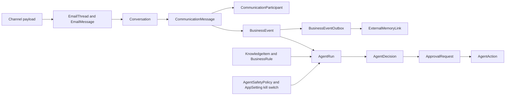

# AI CRM Core Foundation

## Current Architecture

The application uses one workspace today. Better Auth provides the workspace record, but CRM records do not carry tenant keys yet.

The API owns deterministic reads and writes. It does not run enrichment logic or agent intelligence. It writes durable rows for the agent to process.

Email sync writes to `EmailThread` and `EmailMessage`. `ThreadWriterService.store` is the canonical mailbox writer. It also projects email activity to `Activity`.

Agent builder and runtime tables already exist. `AgentDefinition`, `AgentVersion`, `AgentTrigger`, `AgentRun`, `AgentRunEvent`, `AgentAction`, `AgentAuditEvent`, and `AgentConversation` form the first runtime surface.

Contacts, companies, deals, bookings, activities, fields, website tracking, and connected mailbox sync already exist.

## Foundation Model

## Implemented Backbone

The foundation adds `BusinessUnit`, `ChannelAccount`, `CustomerIdentity`, `Conversation`, `CommunicationMessage`, `CommunicationParticipant`, `ConversationInsight`, `BusinessEvent`, and `BusinessEventOutbox`.

The foundation adds `AgentCapability`, `AgentPermission`, `AgentDecision`, `ApprovalRequest`, `KnowledgeItem`, `KnowledgeVersion`, `BusinessRule`, `ExternalMemoryLink`, `BusinessTask`, `AutomationRule`, `AutomationExecution`, and `AgentSafetyPolicy`.

The foundation extends existing agent action rows with before state, requested payload, actual result, confidence, approval link, and evidence references.

The foundation extends `AgentRun` with an optional `BusinessEvent` link.

The foundation extends `AppSetting` with `aiAutomationKillSwitch`.

## Conversation Flow

`ThreadWriterService.store` still writes the existing mailbox tables first.

The same transaction upserts one `Conversation` per `EmailThread`.

The same transaction upserts one `CommunicationMessage` per `EmailMessage`.

The same transaction refreshes message participants.

The same transaction upserts a `BusinessEvent` with an idempotency key.

The same transaction creates a `BusinessEventOutbox` row for the future memory bridge when the event is new.

## BusinessEvent Contract

`BusinessEvent` stores event type, source, channel, actor, record links, occurred time, JSON payload, correlation ID, causation ID, and idempotency key.

The model supports CRM events, mailbox events, website events, agent events, automation events, and future n8n events.

The outbox separates storage from delivery. A later worker can export to memory or external systems without changing the write path.

## Agent Runtime Contract

`AgentCapability` describes what an agent can do.

`AgentPermission` describes what an agent is allowed to do.

`AgentDecision` records a proposed or executed decision with evidence, confidence, risk, and status.

`AgentSafetyPolicy` stores per-agent and per-business-unit safety controls.

`ApprovalRequest` stores human approval before risky action execution.

`AgentAction` stores the durable audit trail for planned, requested, and completed work.

## Knowledge And Rules

`KnowledgeItem` stores durable business knowledge.

`KnowledgeVersion` stores versioned content and approval state.

`BusinessRule` stores deterministic rules linked to optional knowledge.

Rules default inactive. A person must enable them before runtime use.

## Memory Bridge

`ExternalMemoryLink` maps CRM entities and knowledge items to external memory provider identifiers.

`BusinessEventOutbox` stores export payloads for future workers.

The current implementation writes outbox records only for mailbox communication events.

## Product Surfaces

`businessOs.overview` returns command-centre counts, recent conversations, approvals, events, automation executions, and the kill switch.

`businessOs.inbox` returns unified conversation rows.

`businessOs.conversation` returns a conversation detail graph.

`businessOs.customer360` returns contact-linked identities, conversations, insights, tasks, events, approvals, deals, activities, and readiness gaps.

`businessOs.globalSearch` searches companies, contacts, deals, bookings, conversations, messages, activities, knowledge, and business events.

`businessOs.approvals`, `businessOs.knowledge`, and `businessOs.observability` expose dedicated operational views.

The app adds `/inbox` and `/command` routes.

The contact sheet adds a `360` tab.

## Multi-Business Path

`BusinessUnit` and `ChannelAccount` create the future boundary for multiple businesses.

Existing CRM records remain workspace-wide in this step.

Future tenancy work must add a scoped business-unit relation to CRM records and backfill ownership rules.

## Safety Position

The foundation defaults automation to safe storage only.

No new endpoint executes agent actions.

No new endpoint sends messages.

No new endpoint changes production data.

The global kill switch exists in settings data.

Per-agent safety policies default disabled.
